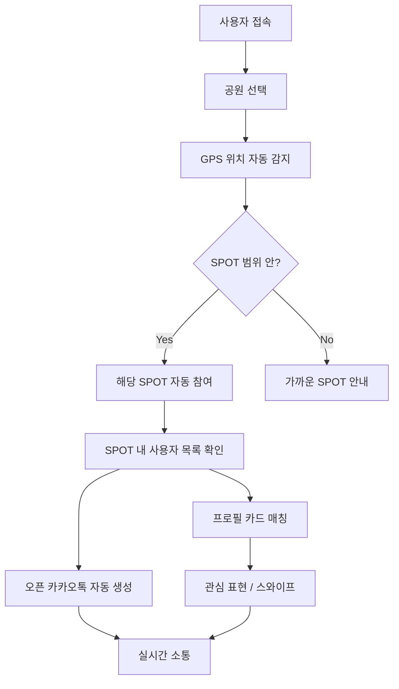

# 🌳 파크팅 (Parkting)

> **공원에서 만나는 새로운 인연** — GPS 기반 공원 소셜 네트워킹 서비스


---

## 💡 서비스 소개

**파크팅**은 실제 공원 내 GPS 위치를 기반으로, 같은 공간에 있는 사람들을 자연스럽게 연결하는 **공원 기반 소셜 네트워킹** 서비스입니다.

소개팅 앱의 매칭 감성과 지역 커뮤니티 플랫폼을 결합하여, **MZ세대**가 공원에서 새로운 인연을 만들고, 지역 축제에 참여하며, 로컬 경제를 활성화하는 것을 목표로 합니다.

### 🎯 해결하려는 문제

| 문제 | 파크팅의 해결 |
|------|-------------|
| 지역 축제의 낮은 MZ세대 참여율 | 소개팅 앱 감성의 이벤트 참여 UX |
| 가족 단위 중심 축제 → 젊은 층 소외 | SPOT 기반 또래 연결 시스템 |
| 축제 운영의 높은 비용 | 디지털 SPOT으로 비용 절감 |
| 로컬 창업·경제 활성화 한계 | 공원 방문자 데이터 기반 지역 연계 |

---

## 🏗️ 서비스 구조

```
사용자 → 공원 선택 → GPS 위치 감지 → SPOT 자동 매칭 → 오픈채팅 연결
```

### 핵심 시스템: SPOT (Smart Park Open Territory)

공원 내 특정 구역(달리기 트랙, 호수, 잔디광장 등)을 **가상 모임 장소**로 정의합니다.

```
┌─────────────────────────────────────────────┐
│                  공원 지도                    │
│                                             │
│    ┌──────────┐     ┌──────────┐            │
│    │ 🏃 달리기 │     │ 🌊 호수  │            │
│    │  트랙     │     │  광장    │            │
│    │ SPOT     │     │ SPOT    │            │
│    │ (반경150m)│     │(반경100m)│            │
│    │ 12명 접속 │     │ 8명 접속 │            │
│    └──────────┘     └──────────┘            │
│                                             │
│    ┌──────────┐     ┌──────────┐            │
│    │ 🌹 장미원 │     │ 🌿 잔디  │            │
│    │ SPOT     │     │  광장    │            │
│    │ (반경80m) │     │ SPOT    │            │
│    │ 15명 접속 │     │(반경120m)│            │
│    └──────────┘     └──────────┘            │
└─────────────────────────────────────────────┘
```

### 동작 흐름



---

## 📱 주요 기능

### 1. 🗺️ SPOT 시스템
- 공원 내 특정 구역을 **가상 SPOT**으로 정의
- 각 SPOT은 GPS 좌표 + 반경으로 구성
- SPOT 유형: 🏅 스포츠 / 🍃 힐링 / 💕 로맨틱 / 🤝 소셜 / 🎨 문화

### 2. 📍 GPS 실시간 위치 연동
- **Geolocation API**로 사용자 위치 실시간 추적
- SPOT 범위 진입 시 자동으로 해당 SPOT에 참여
- 같은 SPOT 내 사용자끼리 자동 연결

### 3. 💕 소개팅 스타일 매칭
- **스와이프 기반** 프로필 카드 (Tinder 감성)
- 관심사, 위치, 활동 기반 매칭
- Like / Nope / Super Like 액션

### 4. 💬 오픈 카카오톡 자동 생성
- 같은 SPOT에 있는 사람들을 위한 **카카오톡 오픈채팅** 자동 생성
- 이벤트별 전용 채팅방 운영
- 실시간 소통으로 즉각적인 만남 연계

### 5. 🎪 이벤트 & 축제 연동
- 지역 축제/이벤트와 SPOT 연결
- MZ세대 참여 유도 특화 UX
- 실시간 참가자 수 확인 및 참가 신청

---

## 💰 서비스 가치

### 사용자 가치
- 🌿 **자연스러운 만남**: 앱이 아닌 실제 공간에서의 인연
- 🎯 **관심사 기반 연결**: 같은 활동(러닝, 요가, 피크닉)을 하는 사람끼리
- 📍 **위치 기반 신뢰**: 같은 공간에 있다는 물리적 신뢰감
- 🎪 **다양한 경험**: 축제, 이벤트, 모임을 통한 새로운 경험

### 지역 사회 가치
- 📊 **MZ세대 참여율 증대**: 소개팅 앱 감성으로 젊은 층 유입
- 💸 **축제 비용 절감**: 디지털 SPOT으로 물리적 인프라 비용 감소
- 🏪 **로컬 경제 활성화**: 공원 주변 상권, 카페, 식당 방문 유도
- 🤝 **지역 커뮤니티 강화**: 주민 간 유대감, 동네 문화 형성

### 비즈니스 모델
- 🌟 **프리미엄 매칭**: 고급 프로필, 무제한 좋아요
- 📢 **로컬 광고**: 공원 주변 상점/카페 타겟 광고
- 🎫 **이벤트 수수료**: 유료 이벤트 중개 수수료
- 📊 **데이터 분석**: 지자체 대상 방문자 데이터 리포트

---

## 🛠️ 기술 스택

```
Frontend:     HTML5 / CSS3 / Vanilla JavaScript (ES Modules)
지도:          Leaflet.js (OpenStreetMap)
위치:          Geolocation API
서버:          Express.js (정적 파일 서빙)
배포:          Render
디자인:        Glassmorphism / Dark Mode / Gradient UI
```

## 📂 프로젝트 구조

```
parkting/
├── index.html          # SPA 메인 (4페이지: 홈/지도/이벤트/매칭)
├── server.js           # Express 정적 서버
├── package.json        # 의존성 관리
├── css/
│   ├── style.css       # 디자인 시스템 (변수, 애니메이션, 타이포)
│   └── components.css  # UI 컴포넌트 (카드, 버튼, 네비게이션)
└── js/
    ├── app.js          # SPA 라우터 + 전역 상태 관리
    ├── data.js         # 목업 데이터 (공원, SPOT, 사용자, 이벤트)
    ├── landing.js      # 랜딩 페이지 로직
    ├── map.js          # Leaflet 지도 + SPOT 시스템
    ├── events.js       # 이벤트/축제 페이지
    └── profile.js      # 소개팅 스와이프 매칭
```

## 🚀 실행 방법

```bash
# 의존성 설치
npm install

# 로컬 서버 실행
npm start

# → http://localhost:3000 에서 확인
```

---

## 🌍 지원 공원 (MVP)

| 공원 | 위치 | SPOT 수 |
|------|------|---------|
| 보라매공원 | 서울 동작구 | 4개 |
| 올림픽공원 | 서울 송파구 | 4개 |
| 여의도 한강공원 | 서울 영등포구 | 4개 |
| 서울숲 | 서울 성동구 | 4개 |

---

## 📋 로드맵

- [x] MVP 웹앱 개발
- [x] GPS SPOT 시스템
- [x] 소개팅 스타일 매칭 UI
- [x] 이벤트/축제 연동
- [ ] 카카오 로그인 연동
- [ ] 실제 오픈채팅 API 연동
- [ ] 사용자 DB 구축 (Firebase/Supabase)
- [ ] PWA 전환 (모바일 앱 경험)
- [ ] 지자체 파트너십

---

<p align="center">
  <b>🌳 파크팅</b> — 모두의 창업 · 지역분야 아이디어<br>
  <sub>공원에서 시작되는 새로운 인연과 지역 커뮤니티</sub>
</p>
